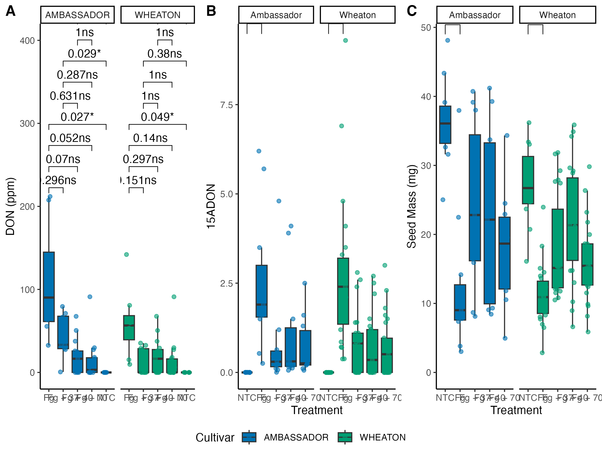

###The link of manuscript is here: 
#### Noel, Z.A., Roze, L.V., Breunig, M., Trail, F. 2022. Endophytic fungi as promising biocontrol agent to protect wheat from Fusarium graminearum head blight. Plant Disease.
[manuscript where these data are published](https://doi.org/10.1094/PDIS-06-21-1253-RE)


Code for Question 5 
```{r}
##### Question 1

# Load libraries
library(dplyr)
library(ggplot2)
library(readr)  

# Read data 
don_data <- read.csv("DON_data.csv", na.strings = "na")
colnames(don_data) <- gsub("\\.", " ", colnames(don_data))
##ambassador
ambassador_ntc <- don_data %>% filter(`Code on vial` %in% c("Glyc  #11", "Glyc  #12", "Glyc  #13", "Glyc  #14", "Glyc  #15", "Glyc  #16", "Glyc  #17"))
ambassador_fg <- don_data %>% filter(`Code on vial` %in% c("Glyc + Fg #1", "Glyc + Fg #2", "Glyc + Fg #3", "Glyc + Fg #4", "Glyc + Fg #5", "Glyc + Fg #6", "Glyc + Fg #7", "Glyc + Fg #8", "Glyc + Fg #9"))
ambassador_37fg <- don_data %>% filter(`Code on vial` %in% c("37 + Fg #7", "37 + Fg #8", "37 + Fg #9", "37 + Fg #10", "37 + Fg #11", "37 + Fg #12", "37 + Fg #13"))
ambassador_40fg <- don_data %>% filter(`Code on vial` %in% c("40 + Fg #1", "40 + Fg #2", "40 + Fg #3", "40 + Fg #4", "40 + Fg #5", "40 + Fg #6", "40 + Fg #7"))
ambassador_70fg <- don_data %>% filter(`Code on vial` %in% c("70 + Fg #1", "70 + Fg #2", "70 + Fg #3", "70 + Fg #4", "70 + Fg #5", "70 + Fg #6", "70 + Fg #7"))

# Extract WHEATON group data
wheaton_ntc <- don_data %>% filter(`Code on vial` %in% c("Glyc  #1", "Glyc  #2", "Glyc  #3", "Glyc  #4", "Glyc  #5", "Glyc  #6"))
wheaton_fg <- don_data %>% filter(`Code on vial` %in% c("Fg #1", "Fg #2", "Fg #3", "Fg #4", "Fg #5", "Fg #6", "Fg #7", "Fg #8"))
wheaton_37fg <- don_data %>% filter(`Code on vial` %in% c("37 + Fg #1", "37 + Fg #2", "37 + Fg #3", "37 + Fg #4", "37 + Fg #5", "37 + Fg #6", "37 + Fg #7", "37 + Fg #13", "37 + Fg #15"))
wheaton_40fg <- don_data %>% filter(`Code on vial` %in% c("40 + Fg #1", "40 + Fg #2", "40 + Fg #3", "40 + Fg #4", "40 + Fg #5", "40 + Fg #6", "40 + Fg #7", "40 + Fg #8", "40 + Fg #9"))
wheaton_70fg <- don_data %>% filter(`Code on vial` %in% c("70 + Fg #1", "70 + Fg #2", "70 + Fg #3", "70 + Fg #4", "70 + Fg #5", "70 + Fg #6", "70 + Fg #7", "70 + Fg #8", "70 + Fg #15", "70 + Fg #20"))

# Merge data and add Cultivar labels
ambassador_ntc$Cultivar <- "AMBASSADOR"
ambassador_fg$Cultivar <- "AMBASSADOR"
ambassador_37fg$Cultivar <- "AMBASSADOR"
ambassador_40fg$Cultivar <- "AMBASSADOR"
ambassador_70fg$Cultivar <- "AMBASSADOR"

wheaton_ntc$Cultivar <- "WHEATON"

wheaton_fg$Cultivar <- "WHEATON"
wheaton_37fg$Cultivar <- "WHEATON"
wheaton_40fg$Cultivar <- "WHEATON"
wheaton_70fg$Cultivar <- "WHEATON"

# Combine all data
combined_data <- bind_rows(ambassador_ntc, ambassador_fg, ambassador_37fg, ambassador_40fg, ambassador_70fg,
                           wheaton_ntc, wheaton_fg, wheaton_37fg, wheaton_40fg, wheaton_70fg)

# Replace "na" with NA and convert DON column to numeric(to adjust y vale) 
combined_data$DON[combined_data$DON == "na"] <- NA
combined_data$DON <- as.numeric(combined_data$DON)

# Remove rows with missing DON values 
combined_data <- combined_data %>% filter(!is.na(DON))

# Change Treatment column's name
combined_data <- combined_data %>%
  mutate(Treatment = case_when(
    Treatment == "Glycerol" ~ "NTC",  # Change Glycerol to NTC
    Treatment == "Glycerol + Fg" ~ "Fg",  # Change Glycerol + Fg to Fg
    TRUE ~ Treatment  # Keep other values unchanged
  ))

# Define blue and green colors
custom_colors <- c("#0072B2", "#009E73")  # Blue and green

# Create the boxplot
DON_plot <- ggplot(combined_data, aes(x=Treatment, y=DON, fill=Cultivar)) +
  geom_boxplot(outlier.shape = NA) +  # Boxplot
  geom_jitter(aes(color=Cultivar), width=0.2, alpha=0.6) +  # Jitter points with transparency 0.6
  scale_fill_manual(values=custom_colors) +  # Fill colors
  scale_color_manual(values=custom_colors) +  # Point colors
  labs(y="DON (ppm)", x="") +  # Axis labels
  theme_classic() +  # Classic theme
  facet_wrap(~Cultivar) +  # Facet by Cultivar
  coord_cartesian(ylim = c(0, 400))  # Set y-axis range from 0 to 400
# Plot 1: save DON figure
ggsave("DON_plot.png", width = 8, height = 6, dpi = 300)
```

###a separate code chunk for the figures plotting the DON data
```{r include_figures1}

```


```{r}
#####Question 2
# Load libraries
library(dplyr)
library(ggplot2)
library(readr)  # For read_csv function

# Read data 
don_data <- read.csv("DON_data.csv", na.strings = "na")
colnames(don_data) <- gsub("\\.", " ", colnames(don_data))
# Extract AMBASSADOR group data
ambassador_ntc <- don_data %>% filter(`Code on vial` %in% c("Glyc  #11", "Glyc  #12", "Glyc  #13", "Glyc  #14", "Glyc  #15", "Glyc  #16", "Glyc  #17"))
ambassador_fg <- don_data %>% filter(`Code on vial` %in% c("Glyc + Fg #1", "Glyc + Fg #2", "Glyc + Fg #3", "Glyc + Fg #4", "Glyc + Fg #5", "Glyc + Fg #6", "Glyc + Fg #7", "Glyc + Fg #8", "Glyc + Fg #9"))
ambassador_37fg <- don_data %>% filter(`Code on vial` %in% c("37 + Fg #7", "37 + Fg #8", "37 + Fg #9", "37 + Fg #10", "37 + Fg #11", "37 + Fg #12", "37 + Fg #13"))
ambassador_40fg <- don_data %>% filter(`Code on vial` %in% c("40 + Fg #1", "40 + Fg #2", "40 + Fg #3", "40 + Fg #4", "40 + Fg #5", "40 + Fg #6", "40 + Fg #7"))
ambassador_70fg <- don_data %>% filter(`Code on vial` %in% c("70 + Fg #1", "70 + Fg #2", "70 + Fg #3", "70 + Fg #4", "70 + Fg #5", "70 + Fg #6", "70 + Fg #7"))

# Extract WHEATON group data
wheaton_ntc <- don_data %>% filter(`Code on vial` %in% c("Glyc  #1", "Glyc  #2", "Glyc  #3", "Glyc  #4", "Glyc  #5", "Glyc  #6"))
wheaton_fg <- don_data %>% filter(`Code on vial` %in% c("Fg #1", "Fg #2", "Fg #3", "Fg #4", "Fg #5", "Fg #6", "Fg #7", "Fg #8"))
wheaton_37fg <- don_data %>% filter(`Code on vial` %in% c("37 + Fg #1", "37 + Fg #2", "37 + Fg #3", "37 + Fg #4", "37 + Fg #5", "37 + Fg #6", "37 + Fg #7", "37 + Fg #13", "37 + Fg #15"))
wheaton_40fg <- don_data %>% filter(`Code on vial` %in% c("40 + Fg #1", "40 + Fg #2", "40 + Fg #3", "40 + Fg #4", "40 + Fg #5", "40 + Fg #6", "40 + Fg #7", "40 + Fg #8", "40 + Fg #9"))
wheaton_70fg <- don_data %>% filter(`Code on vial` %in% c("70 + Fg #1", "70 + Fg #2", "70 + Fg #3", "70 + Fg #4", "70 + Fg #5", "70 + Fg #6", "70 + Fg #7", "70 + Fg #8", "70 + Fg #15", "70 + Fg #20"))

# Merge data and add Cultivar labels
ambassador_ntc$Cultivar <- "AMBASSADOR"
ambassador_fg$Cultivar <- "AMBASSADOR"
ambassador_37fg$Cultivar <- "AMBASSADOR"
ambassador_40fg$Cultivar <- "AMBASSADOR"
ambassador_70fg$Cultivar <- "AMBASSADOR"

wheaton_ntc$Cultivar <- "WHEATON"
wheaton_fg$Cultivar <- "WHEATON"
wheaton_37fg$Cultivar <- "WHEATON"
wheaton_40fg$Cultivar <- "WHEATON"
wheaton_70fg$Cultivar <- "WHEATON"

# Combine all data
combined_data <- bind_rows(ambassador_ntc, ambassador_fg, ambassador_37fg, ambassador_40fg, ambassador_70fg,
                           wheaton_ntc, wheaton_fg, wheaton_37fg, wheaton_40fg, wheaton_70fg)

# Replace "na" with NA and convert DON column to numeric
combined_data$DON[combined_data$DON == "na"] <- NA
combined_data$DON <- as.numeric(combined_data$DON)

# Remove rows with missing DON values 
combined_data <- combined_data %>% filter(!is.na(DON))

# Modify Treatment column values
combined_data <- combined_data %>%
  mutate(Treatment = case_when(
    Treatment == "Glycerol" ~ "NTC",  # Change Glycerol to NTC
    Treatment == "Glycerol + Fg" ~ "Fg",  # Change Glycerol + Fg to fg
    TRUE ~ Treatment  # Keep other values unchanged
  ))

# Change the factor order of Treatment
combined_data$Treatment <- factor(combined_data$Treatment, 
                                  levels = c("NTC", "Fg", "Fg + 37", "Fg + 40", "Fg + 70"))

# Define blue and green colors
custom_colors <- c("#0072B2", "#009E73")  # Blue and green

# Create the boxplot
ggplot(combined_data, aes(x=Treatment, y=DON, fill=Cultivar)) +
  geom_boxplot(outlier.shape = NA) +  # Boxplot
  geom_jitter(aes(color=Cultivar), width=0.2, alpha=0.6) +  # Jitter points with transparency 0.6
  scale_fill_manual(values=custom_colors) +  # Fill colors
  scale_color_manual(values=custom_colors) +  # Point colors
  labs(y="DON (ppm)", x="") +  # Axis labels
  theme_classic() +  # Classic theme
  facet_wrap(~Cultivar) +  # Facet by Cultivar
  coord_cartesian(ylim = c(0, 400))  # Set y-axis range from 0 to 400


#####Question 3

# Load required libraries
library(dplyr)
library(ggplot2)
library(readr)  # For read_csv function

# Read data

mycotoxin_data <- read.csv("MycotoxinData.csv", na.strings = "na")


# Check column names
print(colnames(mycotoxin_data))

# Filter data for Cultivar Wheaton and Ambassador, and Treatment Fg, Fg + 37, Fg + 40, Fg + 70, NTC
filtered_data <- mycotoxin_data %>%
  filter(Cultivar %in% c("Wheaton", "Ambassador") &
           Treatment %in% c("Fg", "Fg + 37", "Fg + 40", "Fg + 70", "NTC"))

# Replace "na" with NA and convert 15ADON and MassperSeed_mg columns to numeric
filtered_data$`X15ADON`[filtered_data$`15ADON` == "na"] <- NA
filtered_data$`X15ADON` <- as.numeric(filtered_data$`X15ADON`)

filtered_data$MassperSeed_mg[filtered_data$MassperSeed_mg == "na"] <- NA
filtered_data$MassperSeed_mg <- as.numeric(filtered_data$MassperSeed_mg)

# Remove rows with missing values in 15ADON or MassperSeed_mg
filtered_data <- filtered_data %>%
  filter(!is.na(`X15ADON`)) %>%
  filter(!is.na(MassperSeed_mg))

# Ensure Treatment is a factor and set desired order
filtered_data$Treatment <- factor(filtered_data$Treatment, 
                                  levels = c("NTC", "Fg", "Fg + 37", "Fg + 40", "Fg + 70"))

# Define blue and green colors
custom_colors <- c("#0072B2", "#009E73")  # Blue and green

# Plot 1: Boxplot for 15ADON with Fg + 70 added
if ("X15ADON" %in% colnames(filtered_data)) {
  colnames(filtered_data)[colnames(filtered_data) == "X15ADON"] <- "15ADON"
}
plot_15adon <- ggplot(filtered_data, aes(x=Treatment, y=`15ADON`, fill=Cultivar)) +
  geom_boxplot(outlier.shape = NA) + 
  geom_jitter(aes(color=Cultivar), width=0.2, alpha=0.6) + 
  scale_fill_manual(values=custom_colors) + 
  scale_color_manual(values=custom_colors) + 
  labs(y="15ADON", x="Treatment") + 
  theme_classic() + 
  facet_wrap(~Cultivar) + 
  coord_cartesian(ylim = c(0, max(filtered_data$`15ADON`, na.rm = TRUE)))

# Save updated 15ADON figure
ggsave("plot_15adon.png", plot = plot_15adon, width = 8, height = 6, dpi = 300)
```
###a separate code chunk for the figures plotting the 15adon data
```{r include_figures2}

```

# Plot 2: Boxplot for MassperSeed_mg with Fg + 70 added
```{r}
mass_per_seed_plot <- ggplot(filtered_data, aes(x=Treatment, y=MassperSeed_mg, fill=Cultivar)) +
  geom_boxplot(outlier.shape = NA) + 
  geom_jitter(aes(color=Cultivar), width=0.2, alpha=0.6) + 
  scale_fill_manual(values=custom_colors) + 
  scale_color_manual(values=custom_colors) + 
  labs(y="Seed Mass (mg)", x="Treatment") + 
  theme_classic() + 
  facet_wrap(~Cultivar) + 
  coord_cartesian(ylim = c(0, max(filtered_data$MassperSeed_mg, na.rm = TRUE)))

# Save updated MassperSeed_mg figure
ggsave("mass_per_seed_plot_updated.png", plot = mass_per_seed_plot, width = 8, height = 6, dpi = 300)
```


###a separate code chunk for the figures plotting the MassperSeed_mg figure
```{r include_figures3}

```
```

###Question 4
```{r}
library(ggpubr)

# Use ggarrange to combine the plots
combined_plot <- ggarrange(
  DON_plot,          
  plot_15adon,     
  mass_per_seed_plot, 
  ncol = 3, nrow = 1,
  labels = c("A", "B", "C"),
  common.legend = TRUE,
  legend = "bottom"
)


# Display the combined plot
print(combined_plot)

# Save the combined plot as a PNG file
ggsave("combined_plot.png", plot = combined_plot, width = 16, height = 6, dpi = 300)


###quuetion 5
## #Add t-test significance markers to plot 1
DON_plot_ttest <- DON_plot +
  geom_pwc(
    aes(group = Treatment),          # Grouping variable for pairwise comparison
    method = "t_test",               # Perform t-test
    label = "{p.adj.format}{p.adj.signif}",  # Display adjusted p-value and significance stars
    p.adjust.method = "bonferroni"   # Adjust p-values using Bonferroni correction
  )


# Save the updated plot with t-test results
ggsave("DON_plot_with_geom_pwc.png", plot = DON_plot_ttest, width = 8, height = 6, dpi = 300)


#Add t-test significance markers to plot 2
plot_15adon_ttest <- plot_15adon +
  geom_pwc(
    aes(group = Treatment),          # Grouping variable for pairwise comparison
    method = "t_test",               # Perform t-test
    label = "{p.adj.format}{p.adj.signif}",  # Display adjusted p-value and significance stars
    p.adjust.method = "bonferroni"   # Adjust p-values using Bonferroni correction
  )


# Save the updated plot with t-test results
ggsave("plot_15adon_with_ttest.png", plot = plot_15adon_ttest, width = 8, height = 6, dpi = 300)

#Add t-test significance markers to plot 3
mass_per_seed_plot_ttest <- mass_per_seed_plot +
  geom_pwc(
    aes(group = Treatment),          # Grouping variable for pairwise comparison
    method = "t_test",               # Perform t-test
    label = "{p.adj.format}{p.adj.signif}",  # Display adjusted p-value and significance stars
    p.adjust.method = "bonferroni"   # Adjust p-values using Bonferroni correction
  )


#Save the updated plot with t-test results
ggsave("mass_per_seed_plot_with_ttest.png", plot = mass_per_seed_plot_ttest, width = 8, height = 6, dpi = 300)

# Use ggarrange to combine the plots
combined__with_ttestplot <- ggarrange(
  DON_plot_ttest,          
  plot_15adon_ttest,     
  mass_per_seed_plot_ttest, 
  ncol = 3, nrow = 1,
  labels = c("A", "B", "C"),
  common.legend = TRUE,
  legend = "bottom"
)
# Display the combined plot
print(combined__with_ttestplot)

# Save the combined plot as a PNG file
ggsave("combined__with_ttestplot.png", plot = combined__with_ttestplot, width = 8, height = 6, dpi = 300)

```


###a separate code chunk for three combined figure
```{r include_figures4}

```

